# SameCast Architecture

A detailed guide to how SameCast works — from user interaction to API calls, caching, and rendering.

---

## System Overview

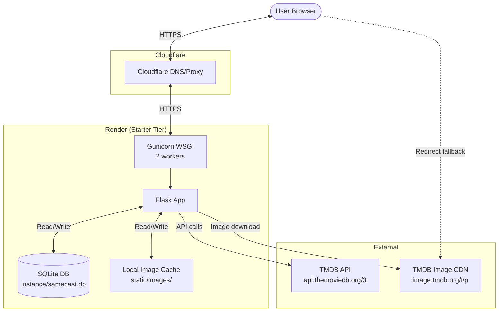

---

## Tech Stack

| Layer | Technology | Purpose |
|-------|-----------|---------|
| **Frontend** | HTMX 2.0 | AJAX without writing JS — partial HTML swaps |
| **Styling** | Tailwind CSS + DaisyUI | Utility-first CSS with component library |
| **Backend** | Flask 3.1 | Python web framework |
| **ORM** | Flask-SQLAlchemy | Database models and queries |
| **Database** | SQLite | Persistent local storage on Render disk |
| **WSGI Server** | Gunicorn | Production server with 2 workers |
| **External API** | TMDB API v3 | Movie/TV data source |
| **DNS/CDN** | Cloudflare | DNS proxy, SSL termination |
| **Hosting** | Render | Starter tier ($7/month) |

---

## Project Structure

```
app/
├── __init__.py              # App factory, CLI commands
├── config.py                # Environment-based configuration
├── models.py                # SQLAlchemy models (Title, Person, Credit, Suggestion)
├── routes/
│   ├── main.py              # GET /  and  GET /compare
│   ├── search.py            # GET /search/autocomplete  and  GET /search/select
│   └── images.py            # GET /images/poster/<file>  and  GET /images/profile/<file>
├── services/
│   ├── tmdb.py              # TMDB API client wrapper
│   ├── cache.py             # DB caching layer (permanent, year-aware)
│   └── comparison.py        # Shared cast/crew set-intersection logic
├── templates/
│   ├── base.html            # Layout: floating theme toggle, footer
│   ├── index.html           # Homepage: search boxes, suggestions, results area
│   └── partials/
│       ├── search_results.html   # Autocomplete dropdown items
│       ├── selected_title.html   # Selected title card with hidden fields
│       ├── comparison.html       # Shared cast/crew result cards
│       └── error.html            # Error alert banner
└── static/
    ├── css/custom.css        # Animations, transitions, theme styles
    └── images/
        ├── posters/          # Cached poster images (w500)
        └── profiles/         # Cached profile photos (w185)
```

---

## Database Schema

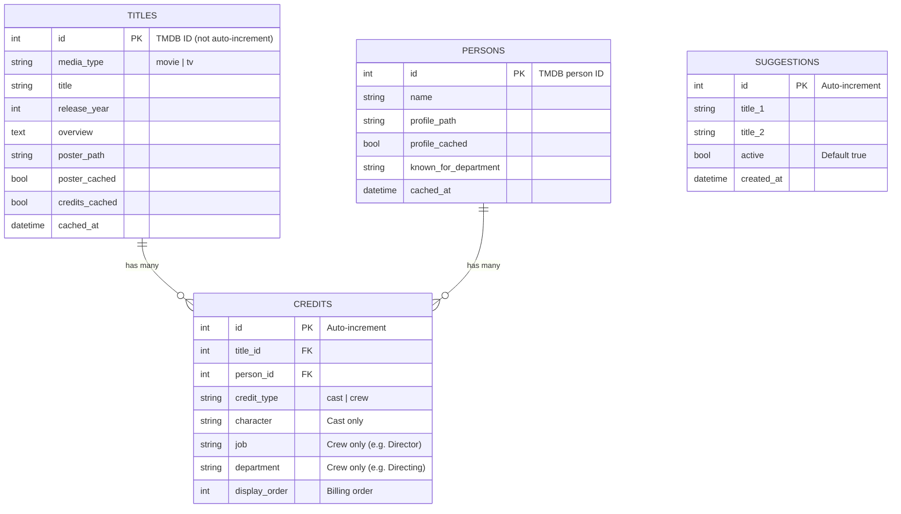

**Indexes on `credits`:**
- `ix_credit_title_person` — composite on `(title_id, person_id)` for finding shared people
- `ix_credit_person` — on `person_id` for person-centric queries

---

## User Flow: Full Comparison

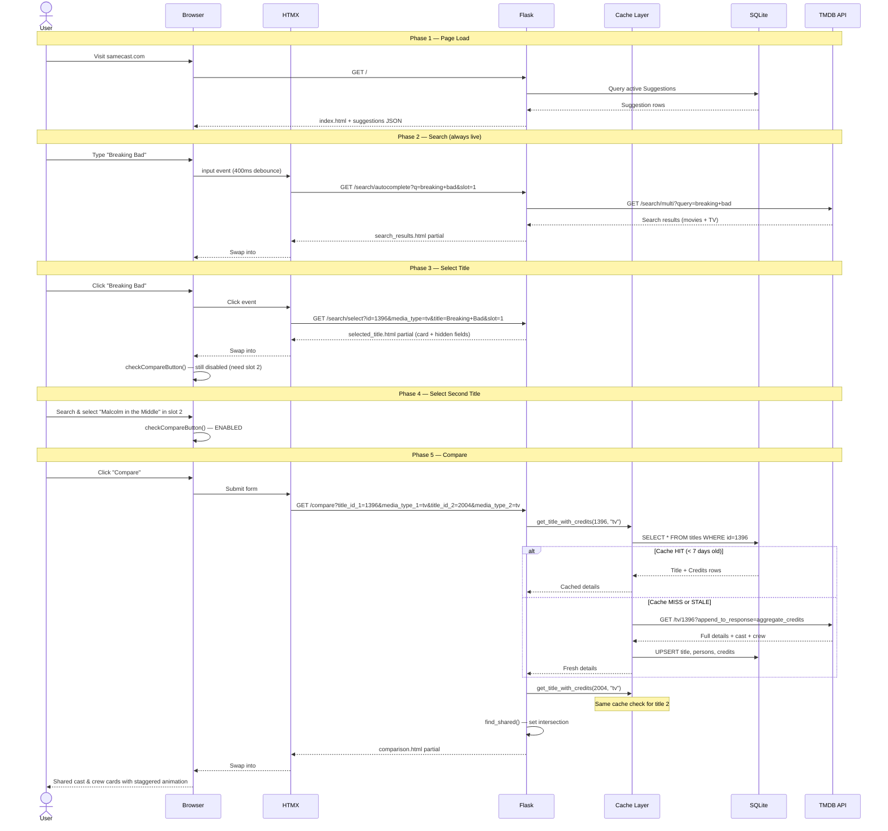

---

## Caching Strategy

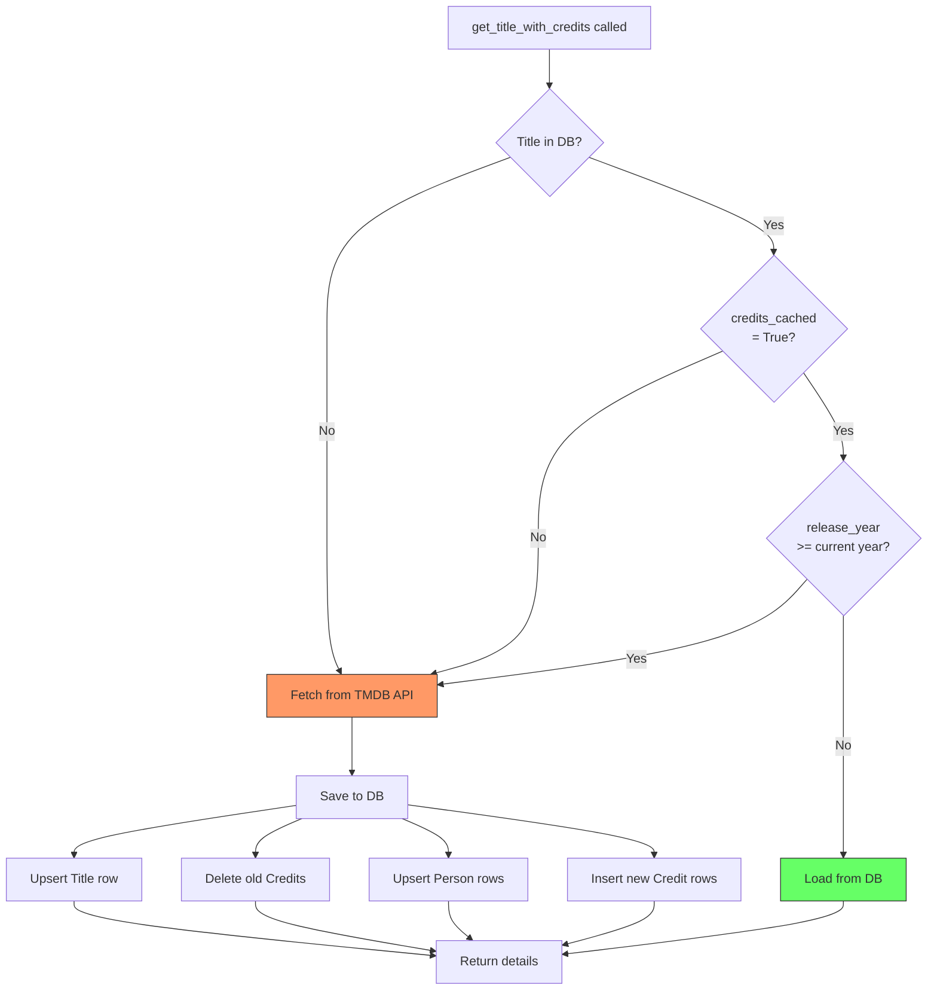

**Key design decisions:**
- **Search autocomplete always hits TMDB** — ensures fresh, complete results
- **Comparison uses DB cache** — avoids redundant API calls for previously compared titles
- **Cache is permanent for past titles** — movie/TV credits don't change after release
- **Current/future year titles always re-fetch** — credits may be incomplete before release
- **Manual refresh via CLI** — `flask cache refresh <title_id>` clears cache for any title
- **Full credit refresh on cache miss** — deletes all old credits, re-inserts (avoids stale data)

---

## Image Proxy Flow

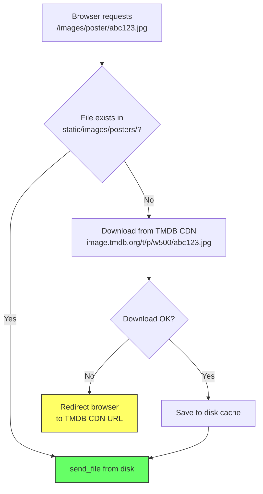

**Image sizes used:**
| Type | Route | TMDB Size | Typical File |
|------|-------|-----------|-------------|
| Poster thumbnail | Autocomplete dropdown | `w92` | ~5 KB |
| Poster | Selected card & results | `w500` | ~100-200 KB |
| Profile photo | Result cards | `w185` | ~50-100 KB |

---

## HTMX Interaction Pattern

SameCast uses HTMX for all dynamic interactions — no client-side JavaScript framework needed.

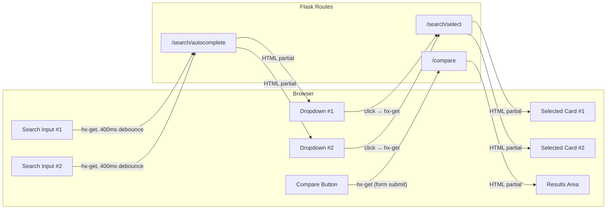

**How HTMX replaces a traditional SPA:**
- Each server response is an HTML fragment, not JSON
- `hx-target` specifies which DOM element to update
- `hx-swap="innerHTML"` replaces the target's content
- `hx-trigger` controls when requests fire (input changes, clicks, form submit)
- `hx-indicator` shows/hides a loading spinner during requests

---

## Comparison Algorithm

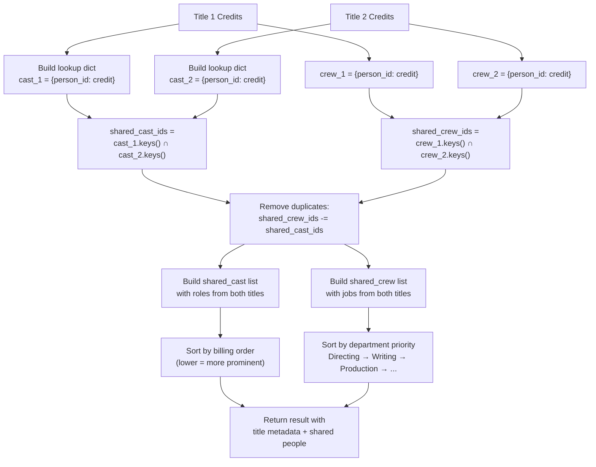

**Department sort priority:** Directing > Writing > Production > Sound > Camera > Art > ... > Other

---

## TV vs Movie Credits: A Key Difference

TMDB structures credits differently for movies and TV shows. This is one of the trickiest parts of the codebase.

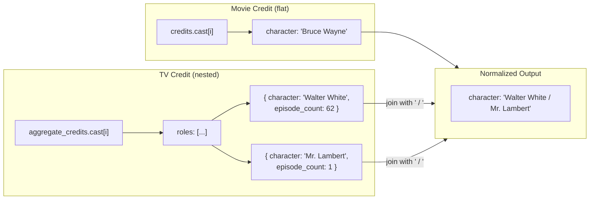

The same pattern applies to crew: movies have a single `job` field, TV shows have a `jobs` array.

---

## Theme System

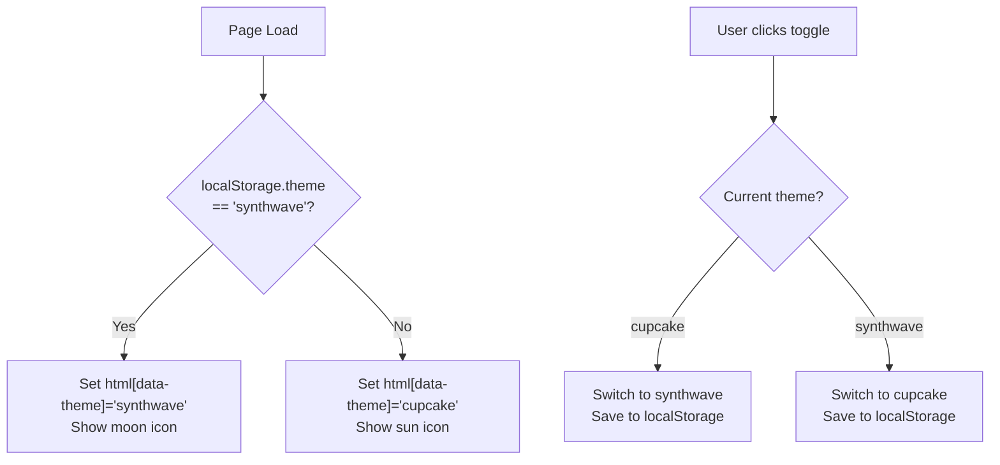

**Themes:**
- **Cupcake** (light) — warm pastels, soft shadows
- **Synthwave** (dark) — neon colors, dark background

DaisyUI handles all component color changes automatically via CSS variables tied to `data-theme`.

---

## Suggestion Rotation

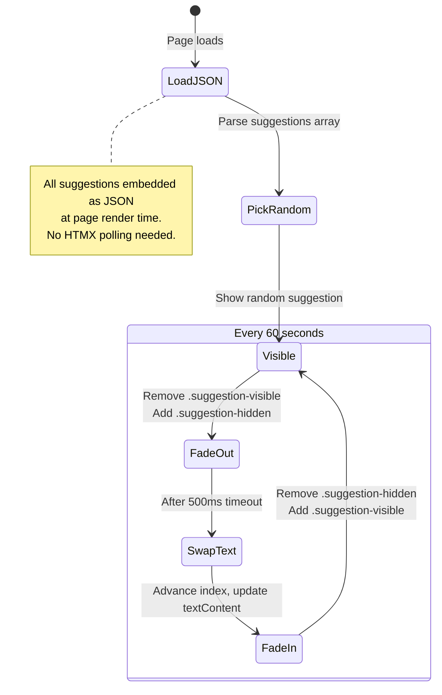

---

## Deployment Architecture

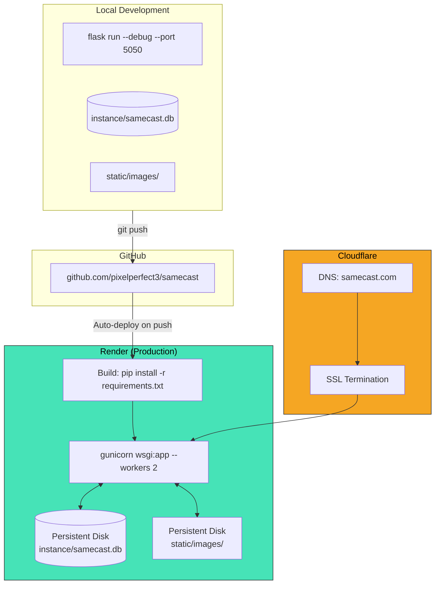

**Environment variables on Render:**
- `TMDB_API_KEY` — set manually in dashboard
- `SECRET_KEY` — auto-generated by Render
- `FLASK_ENV` — `production`
- `DATABASE_URL` — `sqlite:///samecast.db`

---

## Request Routing Summary

| Method | Path | Handler | Returns | Cached? |
|--------|------|---------|---------|---------|
| GET | `/` | `main.index` | Full HTML page | No |
| GET | `/compare` | `main.compare` | HTML partial (results) | DB cache for TMDB data |
| GET | `/search/autocomplete` | `search.autocomplete` | HTML partial (dropdown) | Never (always live) |
| GET | `/search/select` | `search.select` | HTML partial (card) | No |
| GET | `/images/poster/<file>` | `images.poster` | Image file | Disk cache |
| GET | `/images/profile/<file>` | `images.profile` | Image file | Disk cache |

---

## CLI Commands

```bash
# Seed 10 starter suggestions (idempotent — safe to re-run)
flask --app wsgi suggestions seed

# Add a custom suggestion pair
flask --app wsgi suggestions add 'Goodfellas' 'The Sopranos'

# List all suggestions with status
flask --app wsgi suggestions list
```
